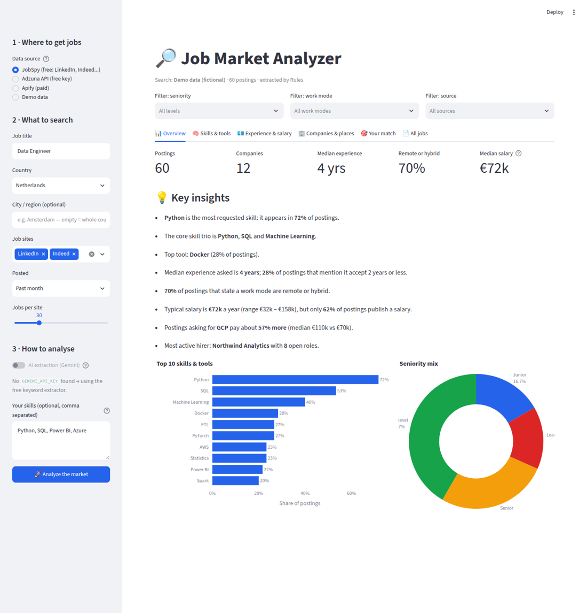
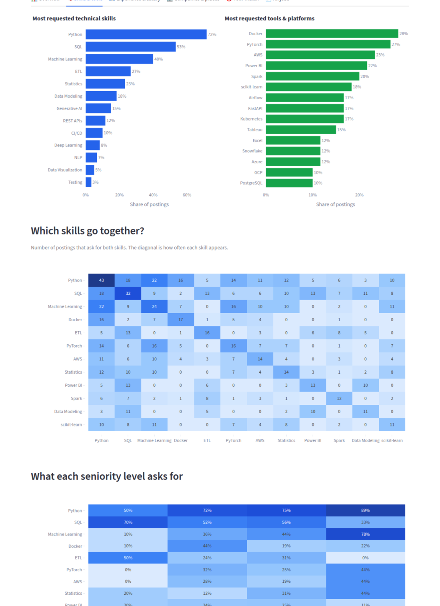
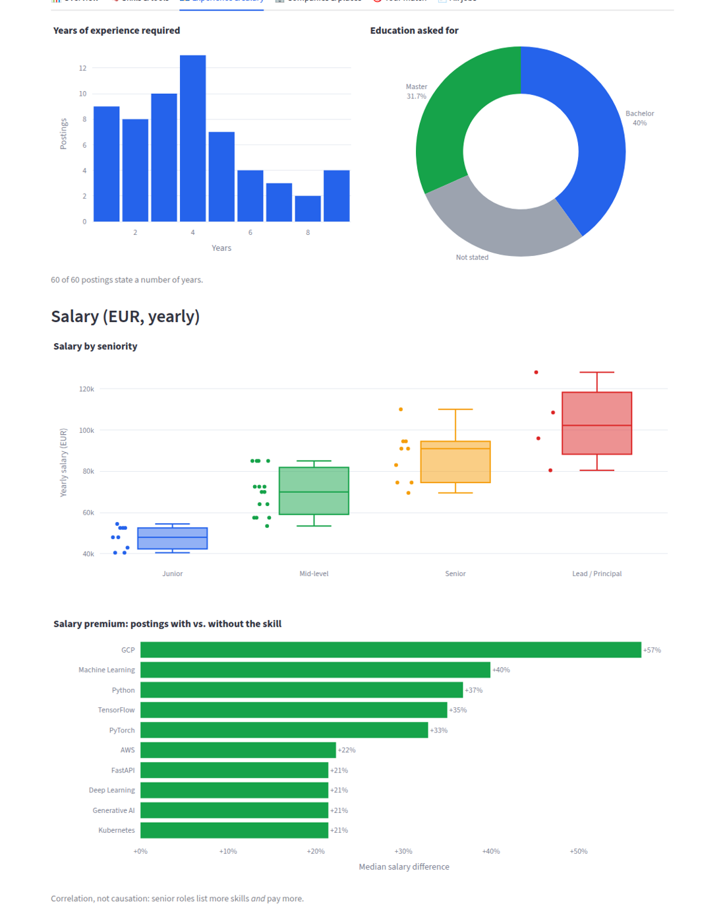
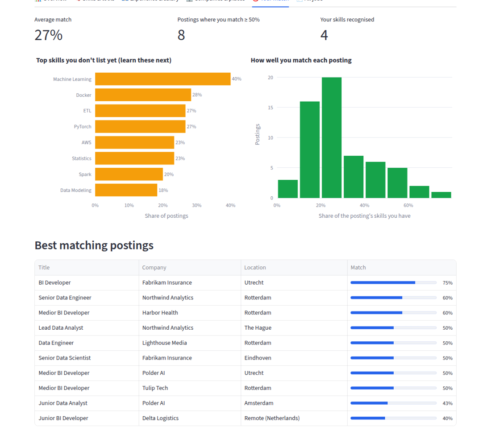

# 🔎 Job Market Analyzer

**Type a job title, get a picture of the market.**
The app collects real job postings (free from LinkedIn, or from Indeed, Glassdoor, Google Jobs and Adzuna), reads every posting, and shows you in simple charts:

- which **skills and tools** employers ask for most
- how many **years of experience** they want
- what the jobs **pay** and which skills pay more
- **who is hiring**, where, and whether it's remote
- **how well *you* match** the market, and which skills to learn next



---

## ▶️ Try it in 1 minute (no keys, no accounts)

You need **Python 3.10 or newer** (3.13 works). Open a terminal (on Windows: *Command Prompt*) and run:

```bash
git clone https://github.com/Shehab89/job-analyzer.git
cd job-analyzer
python -m pip install -r requirements.txt
python -m streamlit run app.py
```

Your browser opens at `http://localhost:8501`. Click **"Try it now with demo data"** to see the full dashboard, or keep the source on **LinkedIn (free, built-in)**, type a job title and press **Analyze the market**.

> 💡 Always run the commands **inside the `job-analyzer` folder** (that's what `cd job-analyzer` does). *"No such file: requirements.txt"* or *"File does not exist: app.py"* means you're in the wrong folder.
>
> No `git`? Download the ZIP from the green **Code** button on GitHub, unzip it, and `cd` into the unzipped folder.

Demo data is **fictional** (made-up companies). It's there so you can explore the app.

---

## 🧭 How it works (the simple version)

```
 1. COLLECT            2. READ & EXTRACT             3. SHOW
 job postings   ──►    skills, tools, years,   ──►   charts, insights,
 from job sites        salary, remote, degree        your match score
```

1. **Collect.** The app fetches postings for your search from the source you picked.
2. **Read & extract.** Each posting is turned into facts: *"Python, SQL, Azure · 5 years · €70k–90k · Hybrid · Master"*.
   - With a **Gemini key**, AI reads each posting (most accurate).
   - Without a key, a **free keyword engine** does it (fast, offline, good enough for most searches).
   - If the AI fails on a posting (for example because you hit your quota), the app switches to the keyword engine for that posting and keeps going.
3. **Show.** Everything is counted and drawn as charts, plus short plain-English insights such as
   *"Python appears in 72% of postings"* or *"Postings asking for AWS pay about 20% more"*.

---

## 🌐 Where the jobs come from: pick one in the sidebar

| Source | Cost | Needs a key? | Good to know |
|---|---|---|---|
| **LinkedIn (free, built-in)** ⭐ default | Free | No | Reads LinkedIn's public job pages (the ones you see when logged out). Takes about 1–2 seconds per job because it pauses politely between requests. If LinkedIn slows you down after many searches, wait a few minutes or ask for fewer jobs. |
| **JobSpy** (optional extra) | Free | No | Adds **Indeed, Glassdoor and Google Jobs**. Install separately: `python -m pip install -r requirements-jobspy.txt`. ⚠️ Only works on **Python 3.10–3.12**. |
| **Adzuna API** | Free (up to a limit) | Yes, free: [developer.adzuna.com](https://developer.adzuna.com) | An official, very reliable jobs API for NL, UK, DE, US and more. Descriptions are shorter (a summary), so skill counts are a bit lower. |
| **Apify** | Paid | Yes: [apify.com](https://apify.com) | Cloud LinkedIn scraper. The actor can be changed with `APIFY_ACTOR_ID`. |
| **Demo data** | Free | No | 60 fictional postings for trying out the app. |

> ⚖️ Scraping job sites may be against their terms of service. Use it for personal research, keep volumes small, and prefer the **Adzuna API** for anything regular or public.

---

## 🔑 Adding keys (all optional)

1. Copy the example file:
   ```bash
   cp .streamlit/secrets.toml.example .streamlit/secrets.toml
   ```
2. Fill in only what you use:

| Key | What it unlocks | Where to get it |
|---|---|---|
| `GEMINI_API_KEY` | AI extraction (more accurate) | [aistudio.google.com/apikey](https://aistudio.google.com/apikey) (free tier) |
| `ADZUNA_APP_ID`, `ADZUNA_APP_KEY` | Adzuna source | [developer.adzuna.com](https://developer.adzuna.com) |
| `APIFY_API_TOKEN` | Apify source | Apify console → Settings → Integrations |

The same names also work as **environment variables**. On **Streamlit Community Cloud**, paste them under *App settings → Secrets*.

🔒 `secrets.toml` is in `.gitignore`. **Never put keys in the code.**

---

## 📊 What you see in the dashboard

| Tab | What it tells you |
|---|---|
| **📊 Overview** | Key numbers (postings, companies, median experience, % remote/hybrid, median salary), the key insights, top 10 skills and the seniority mix. |
| **🧠 Skills & tools** | Most requested skills and tools (as % of postings), **which skills go together** (heatmap), **what each seniority level asks for**, and soft skills. |
| **💶 Experience & salary** | Years of experience asked, education level, **salary by seniority**, and the **salary premium** per skill (median pay with vs. without that skill). |
| **🏢 Companies & places** | Top hiring companies, top locations, remote/hybrid/on-site split, and which site each posting came from. |
| **🎯 Your match** | Type your skills in the sidebar and see your average match, **the top skills you're missing**, and the postings that fit you best. |
| **📄 All jobs** | Every posting with the extracted facts and a link to the original, plus **Download as CSV**. |

Use the **filters** above the tabs (seniority, work mode, source) to zoom in, for example on *Senior + Remote* only.

<p>
 
</p>



**Reading the numbers correctly**
- Percentages are the **share of postings** that mention something. 40% = 4 out of 10 postings.
- Salary charts only use postings that **publish** a salary (often a minority), converted to **yearly** and in the most common currency.
- The *salary premium* is a correlation, not a promise: senior roles both list more skills *and* pay more.

---

## 🗂️ Project structure

```
app.py              The Streamlit dashboard (sidebar, tabs, charts)
scraper.py          Collects postings (built-in LinkedIn scraper, JobSpy, Adzuna, Apify) → one common format
analyzer.py         Extracts facts from each posting (Gemini AI or the keyword engine)
skills_catalog.py   The list of known skills/tools and their aliases ("sklearn" → "scikit-learn")
insights.py         All the counting, salary maths and the plain-English insights
config.py           Reads keys from secrets.toml or environment variables
sample_data.py      Fictional demo postings
tests/              Automated tests (run with: pytest)
```

**Want to count a skill the keyword engine doesn't know?** Add it to `skills_catalog.py`, for example `"LangChain": []`.

---

## 🧪 Tests

```bash
pip install pytest
pytest
```

The tests cover skill matching, salary/experience parsing, the AI path (mocked), fallbacks, the LinkedIn page parser (including a rate-limit retry), every data source's field mapping, and the insight calculations.

## 🚀 Deploy for free

1. Push this repo to GitHub.
2. Go to [share.streamlit.io](https://share.streamlit.io), then **New app**, and choose this repo with `app.py`.
3. Add your keys under **Advanced settings → Secrets** (same format as `secrets.toml`).

You can also open the repo in **GitHub Codespaces**: the dev container installs everything and starts the app automatically.
